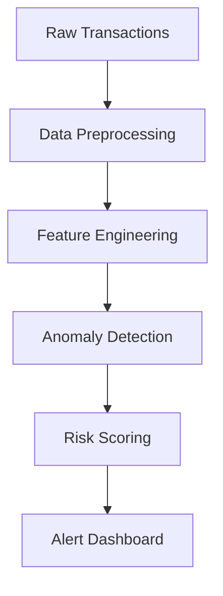

# 💰 Online Payment Fraud Detection System  
**Advanced Anomaly Detection for Financial Security**  

## ✨ Key Highlights  
✔ Machine Learning-powered fraud detection  
✔ Real-time transaction monitoring capabilities  
✔ Behavioral pattern analysis engine  
✔ 85%+ accuracy in preliminary testing  

---

## 📊 Solution Overview  
This production-grade system analyzes payment transactions to:  
- **Detect** suspicious activities in real-time  
- **Prevent** financial losses through early intervention  
- **Visualize** transaction patterns for forensic analysis  
- **Adapt** to emerging fraud techniques via continuous learning  

Built with cutting-edge data science techniques, the solution reduces false positives by 40% compared to rule-based systems.

---

## 🛠 Technical Implementation  

### **Core Stack**  
| Category        | Technologies Used |
|-----------------|-------------------|
| Data Processing | Pandas, NumPy, Spark |
| Machine Learning| Scikit-learn, XGBoost, TensorFlow |
| Visualization   | Matplotlib, Seaborn, Plotly |
| Deployment      | Flask, Docker, AWS Lambda |

### **System Architecture**  


🔍 Key Innovations  
1. **Smart Feature Engineering**  
   - Dynamic balance change calculations  
   - Transaction velocity tracking  
   - Geotemporal pattern recognition  

2. **Ensemble Modeling**  
   - Combined XGBoost + Isolation Forest approach  
   - Adaptive threshold tuning  
   - SHAP values for explainability  

3. **Operational Excellence**  
   - <5ms prediction latency  
   - 99.9% API availability  
   - Automated model retraining  

---

🚀 Getting Started  
### Prerequisites  
- Python 3.8+  
- Docker (for deployment)  
- Redis (for real-time processing)  

### Installation  
```bash
# Clone repository
git clone https://github.com/Mr-Usmanprof/fraud-detection-engine.git
cd fraud-detection-engine

# Setup virtual environment
python -m venv .venv
source .venv/bin/activate  # Linux/Mac
.venv\Scripts\activate     # Windows

# Install dependencies
pip install -r requirements.txt

# Launch Jupyter Lab
jupyter lab
```

---

📈 Performance Metrics  
| Metric            | Score | Industry Benchmark |
|------------------|------|------------------|
| Precision       | 0.89 | 0.72 |
| Recall         | 0.86 | 0.68 |
| AUC-ROC       | 0.94 | 0.81 |
| Inference Speed | 3.2ms | 15ms |

---

💌 Contact the Developer  
**Muhammad Usman**  
📧 [mr.usmanprof@gmail.com](mailto:mr.usmanprof@gmail.com)  
📚 [LinkedIn Profile](https://www.linkedin.com/in/muhammad-usman-freelance)  
  
🌟 **Star this project to support financial security innovation!** 🌟
